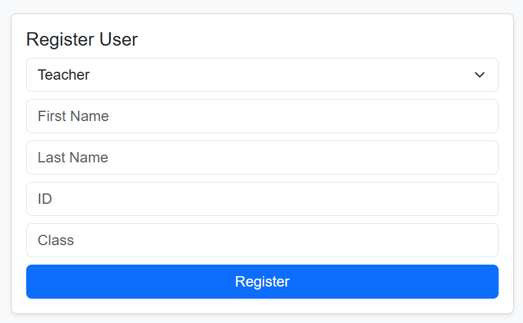
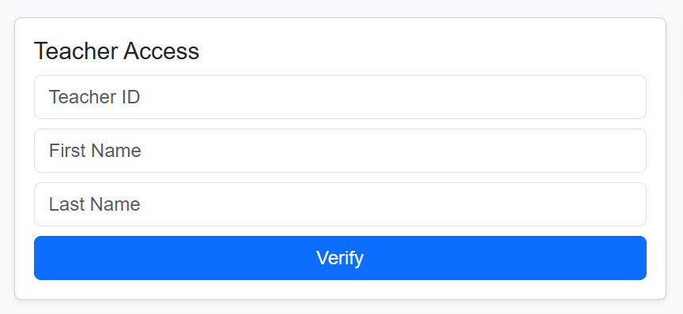
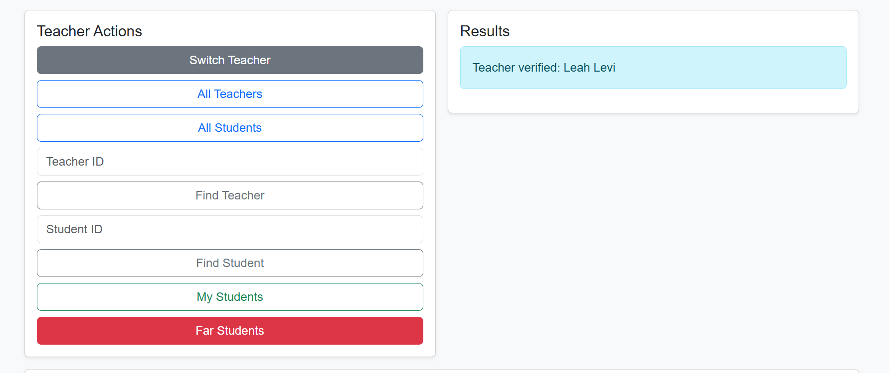
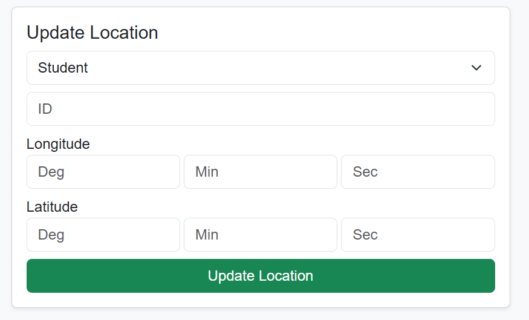
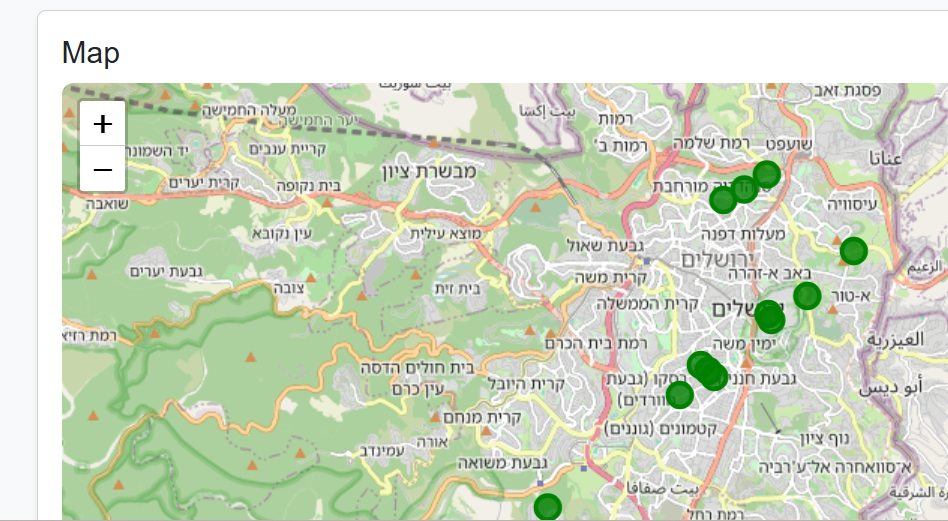
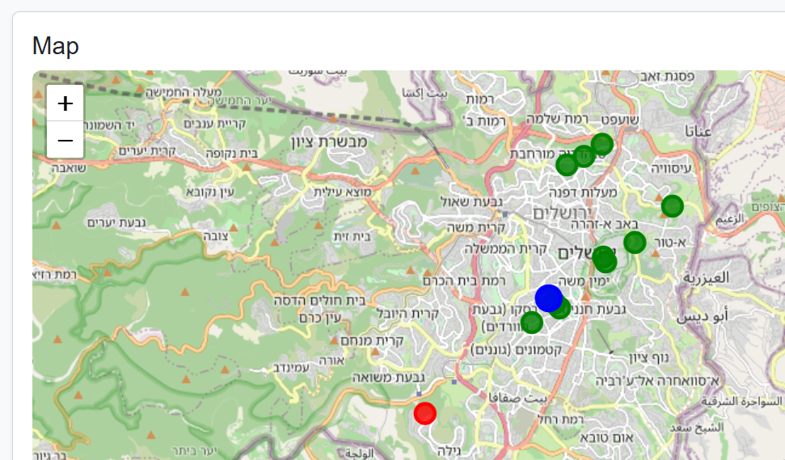

# School Trip Management System

## Overview
This project was developed to assist teachers in managing a school trip for 6th-grade students.

The system allows:
- Managing students and teachers
- Tracking real-time locations
- Displaying locations on a map
- Detecting students who are too far from their teacher

---

## Project Structure

project/
|
|---backend/ # FastAPI server
|
|---frontend/ # UI (HTML, CSS, JavaScript)
|
|---README.md
|
|---screenshots
|
|---.gitignore

---

## How to Run

### 1. Backend

Open terminal:
cd backend
pip install -r requirements.txt
uvicorn main:app --reload

Server will run on:
http://127.0.0.1:8000

---

### 2. Frontend

Open:

frontend/index.html

(No installation required)

---

## How to Use

### 1. Register Users
- Choose Teacher or Student
- Fill in details
- Click Register

📸 Screenshot:  

---

### 2. Teacher Login
- Enter teacher details
- Click Verify

Only verified teachers can access data

📸 Screenshot:  

---

### 3. Teacher Actions
After login:
- View all teachers
- View all students
- Search by ID
- View students in class
- Detect far students

📸 Screenshot:  

---

### 4. Update Location
- Select Student / Teacher
- Enter ID
- Enter coordinates (Degrees / Minutes / Seconds)
- Click Update

📸 Screenshot:  

---

### 5. Map Visualization
- Students appear on the map
- Colors:
  - Green → regular student
  - Red → far student (>3 km)
  - Blue → teacher

📸 Screenshot:  

---

### 6. Safety Feature
- Click "Far Students"
- System highlights students farther than 3 km

📸 Screenshot:  

---

## External Dependencies

### Backend
- FastAPI
- SQLAlchemy
- Uvicorn

Install:

pip install -r requirements.txt

---

### Frontend
- HTML
- CSS
- JavaScript
- Leaflet (map library via CDN)

No installation required

---

### Database
- SQLite
- Created automatically on first run

---

## Info for tutorial:
id="111111111", first_name="Rivka", last_name="Cohen"
id="222222222", first_name="Leah", last_name="Levi"
id="333333333", first_name="Miriam", last_name="Mizrahi"
